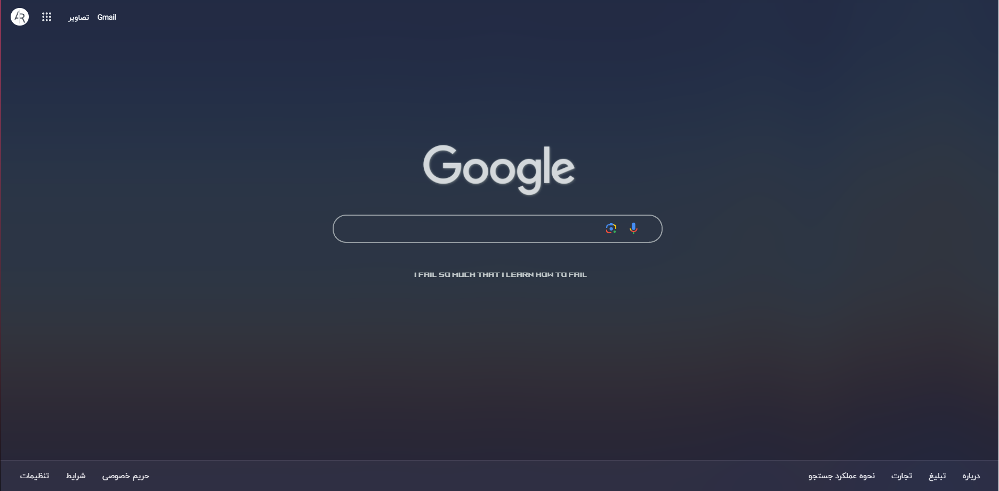
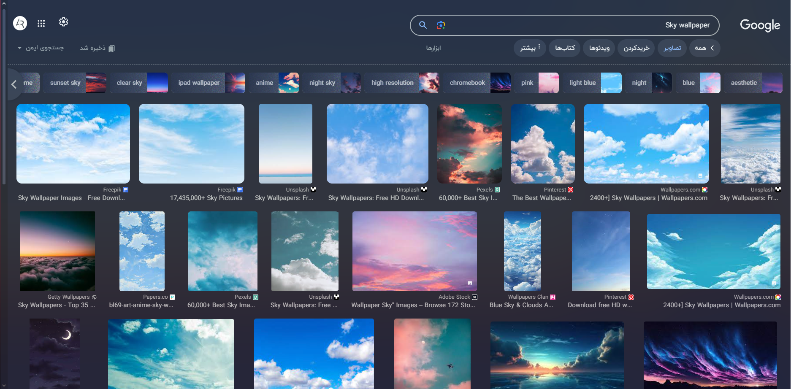
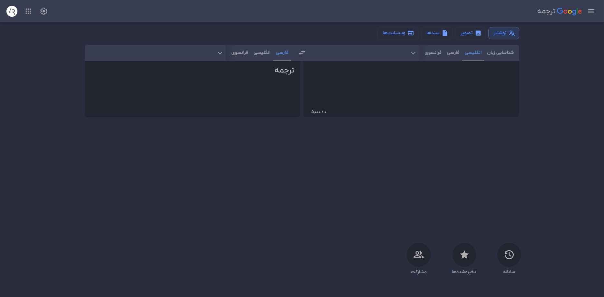
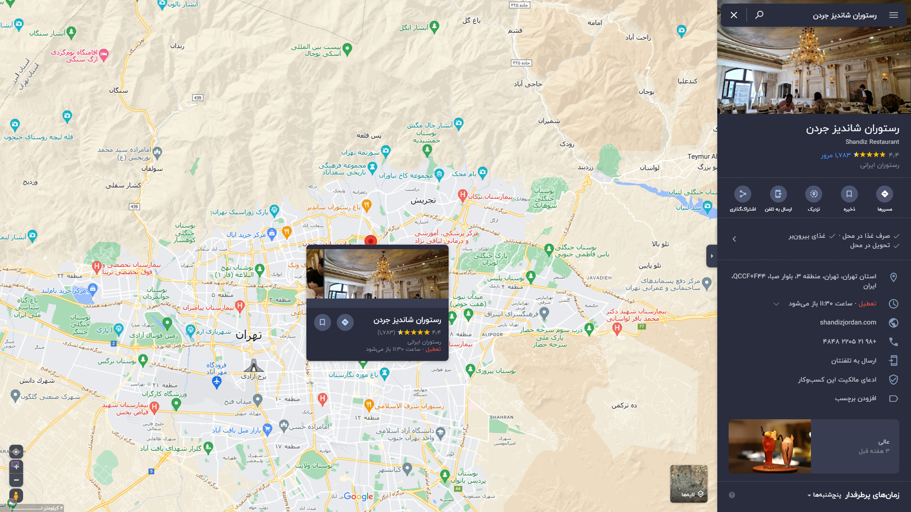
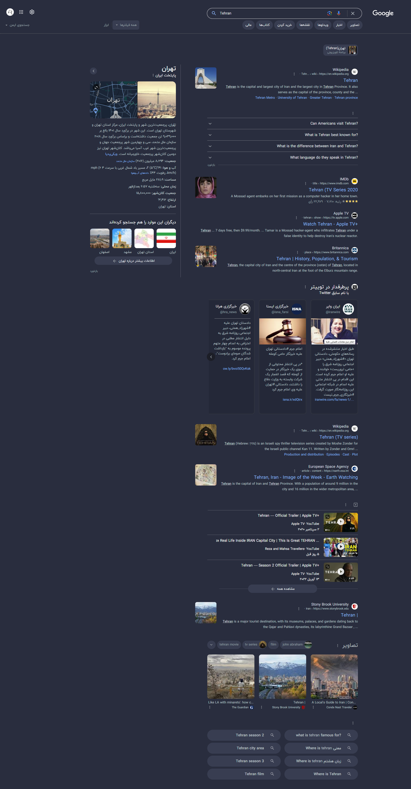
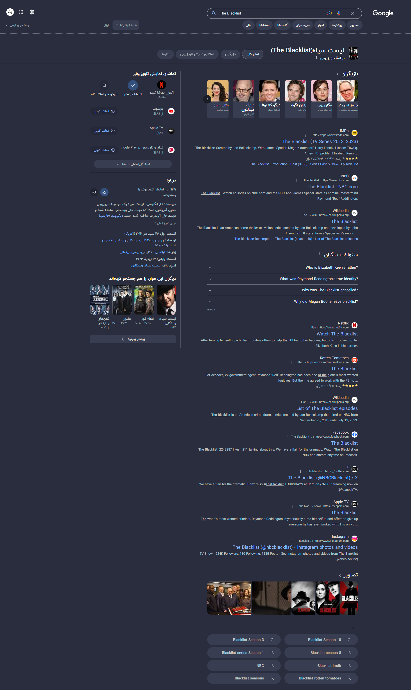

<H2 align="center">
Nord-Theme for Google
</H2>

Modernizing Google pages with the Nord color palette...
<dl><dl>

> Preview image shows with [GX Vibes Shader](https://store.gx.me/mods/cyyg3i/vibes-shader/), [IRANYekan X](https://fontiran.com/fonts/iranyekan) font on 1920x1080 resolution.

## Features

- Built for RTL languages and pages
- Removal annoying sections for cleaner screen
- Removal extra parameters from search URLs
- Customize Finance/Maps color-scheme

## How to use
1. Install any CSS/JS injector extension like [This](https://chromewebstore.google.com/detail/nbhcbdghjpllgmfilhnhkllmkecfmpld)
2. Copy and add [CSS](https://github.com/amoAR/Nord-Google/blob/main/style.css) and [JS](https://github.com/amoAR/Nord-Google/blob/main/javascript.js) codes to your extension and save it
3. Enable it for `https://www.google.com/, https://images.google.com/` Urls

##### To work on the search results page, you must give the _`Allow access to search page results`_ permission for extension.

## Screenshots

|      |  |
| :----------------------------------------------------: | :--------------------------------------------------: |
|      |  |

